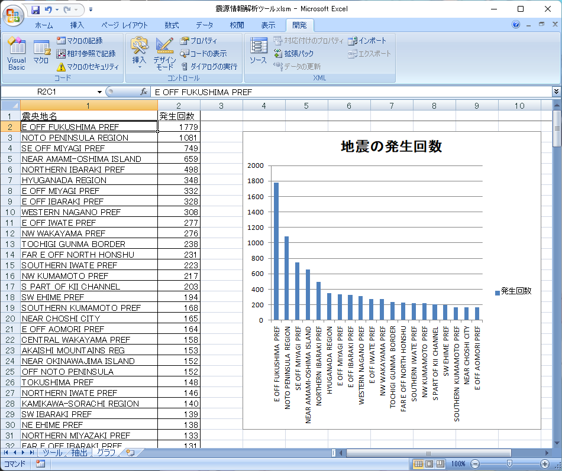
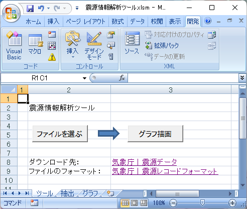
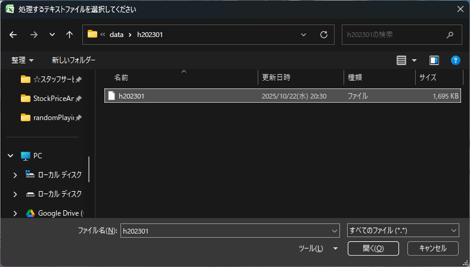
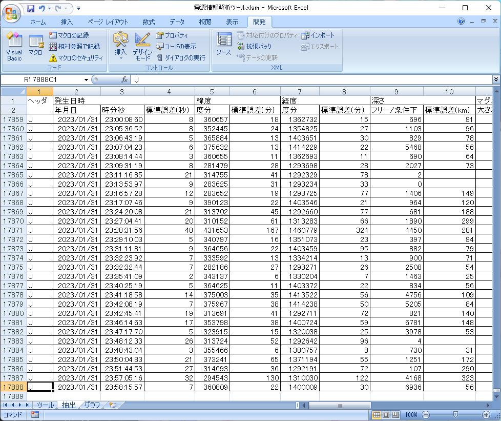

# 震源情報解析ツール

気象庁が公開している震源データを活用し、地震の発生回数を震源地別に集計・可視化するためのExcelツールです。テキストファイルを読み込むだけで、自動的にデータを整理し、グラフを作成します。

## 主な機能

- **データ抽出:** 気象庁の震源データ（テキスト形式）をExcelシートに自動で転記します。
- **自動集計:** 震源地ごとの地震発生回数を自動でカウントし、ランキング形式で表示します。
- **グラフ作成:** 集計結果を基に、発生回数の多い上位20位の震源地を棒グラフで分かりやすく可視化します。

## 動作環境

- Microsoft Excel
  
本ツールはExcelのマクロ機能を使用しています。Microsoft Excelがインストールされている環境であれば、その他のソフトウェアをインストールする必要はありません。

## 使い方（操作手順）

### 1. 震源データのダウンロード
はじめに、[気象庁｜震源データ](https://www.data.jma.go.jp/eqev/data/bulletin/hypo.html)のページにアクセスし、解析したい期間の震源データをダウンロードします。

### 2. ツールの起動とファイル選択
ダウンロードした「震源情報解析ツール.xlsm」を開き、マクロを有効にしてください。
「ツール」シートにある「ファイルを選ぶ」ボタンをクリックします。

### 3. データファイルの指定
先ほどダウンロードしたテキストファイルを選択し、「開く」をクリックします。

データの読み込みが自動で開始され、完了すると「抽出」シートにデータが転記されます。

### 4. グラフの描画
「ツール」シートに戻り、「グラフ描画」ボタンをクリックします。
処理が完了すると、「グラフ」シートに震源地別の発生回数ランキングと、上位20位のグラフが作成されます。

## 注意点

- ファイルを開く際に「コンテンツの有効化」を求められた場合は、マクロを有効にしてください。
- 処理時間はPCの性能やデータの量によって変動します。

## Author

- [qack-dev](https://github.com/qack-dev)
